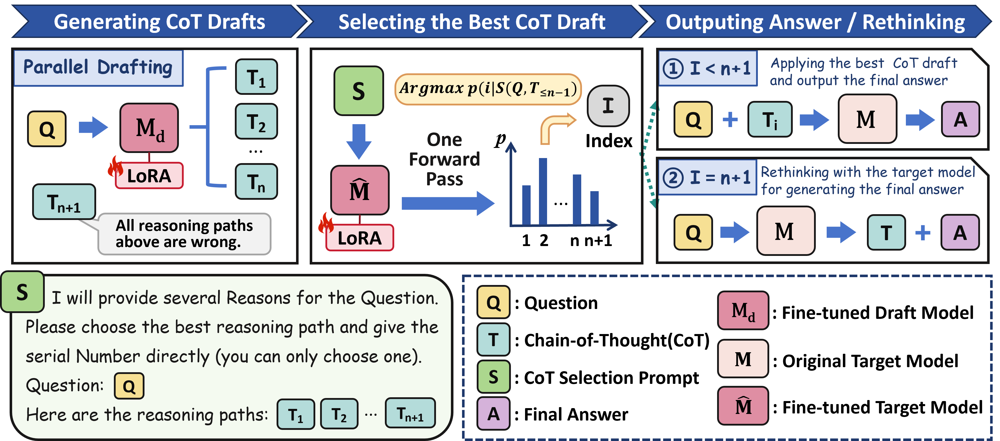

# <center>Efficient Reasoning for LLMs through Speculative Chain-of-Thought</center>

**Paper:** https://arxiv.org/abs/2504.19095

<p align="center">
  
</p>

## Installation
```bash
pip install -r requirements.txt
```

## Evaluate the Base Reasoning Models on Benchmarks
**Supported datasets:** gsm8k, math, gaokao, college_math, olympiad.
```bash
python base.py --bench-name gsm8k --main-model-path deepseek-ai/DeepSeek-R1-Distill-Qwen-32B --model-id Qwen-32B
```

## Evaluate the Performance of SCoT
```bash
python speculative_cot.py --bench-name gsm8k
```


## To Train Your Own LoRA Weights for SCoT 

We provide datasets for training the target model (32B) and the draft model (1.5B) in the ./train/data and ./train_draft/data directories respectively.
We also provide the trained lora weights (32B and 1.5B).
In case you need to make a custom dataset or retrain the lora module, please refer to the following script.

### Prepare data and train the target model
```bash
cd train
python prepare_data.py
python lora_train.py
```
### Prepare data and train the draft model
```bash
cd train_draft
python prepare_data.py
python lora_train.py
```

## Citation
```
@misc{wang2025efficientreasoningllmsspeculative,
      title={Efficient Reasoning for LLMs through Speculative Chain-of-Thought}, 
      author={Jikai Wang and Juntao Li and Lijun Wu and Min Zhang},
      year={2025},
      eprint={2504.19095},
      archivePrefix={arXiv},
      primaryClass={cs.CL},
      url={https://arxiv.org/abs/2504.19095}, 
}
```

## Acknowledgements
Some of the code in this project was built with reference to [Mario](https://github.com/MARIO-Math-Reasoning/MARIO) and [Qwen2.5-Math](https://github.com/QwenLM/Qwen2.5-Math).
